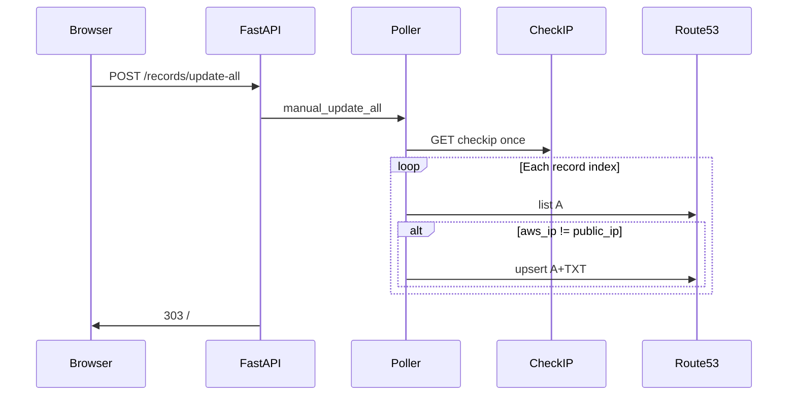

# Phase 2 — Web UI dates and Update all

## Context (from [.plan.md](.plan.md))

- **2.1**: Show dates like `10:35 AM, Wed Apr 19, 2026`, plus a **relative** phrase (minutes/hours/days before/after now). **Display absolute times in the user’s own timezone** (browser locale / OS timezone — the server does not assume a single display zone).
- **2.2** (authoritative product spec):
  - Add a **new button** in the UI to update **all configured records at once** (single action).
  - The button is **enabled only if at least one record is out of date** (same notion of “out of date” as the per-row **Update** button: current public IPv4 differs from the Route53 A value for that row, including missing Route53 value when an update is needed).
  - The handler must **only update out-of-date records** — after one `checkip` fetch and per-index Route53 refresh, call **UPSERT** only for indices where `public_ip != route53_ip`; in-sync rows must incur **no** `ChangeResourceRecordSets`.

Current state: [`src/route53_ddns/templates/index.html`](src/route53_ddns/templates/index.html) renders `datetime.isoformat()` for `last_check_at`, `next_check_at`, and per-row `last_dns_update_at`. [`src/route53_ddns/main.py`](src/route53_ddns/main.py) exposes `GET /` and `POST /records/{index}/update` calling [`manual_update_index`](src/route53_ddns/poller.py). [`snapshot_for_template`](src/route53_ddns/state.py) passes raw `datetime` objects.

---

## 2.1 Human-readable + relative times (viewer’s timezone)

**Why not Jinja-only**

- The app stores **UTC** in [`AppState`](src/route53_ddns/state.py) (unchanged). HTTP does not provide a reliable **user timezone**; the server cannot know the viewer’s zone without extra machinery. **Requirement:** show absolute clock times in **the user’s own timezone** → format on the **client** using the browser’s default IANA zone (user/OS setting).

**Formatting rules**

- **Source of truth in HTML:** for each instant, output a **UTC ISO-8601** string (e.g. `datetime` on `<time>` or `data-*`) parsed by script. Preserve semantics for accessibility (`<time datetime="...">`).
- **Absolute (local):** use **`Intl.DateTimeFormat`** (browser default `timeZone` + `locale`) to produce a human-readable line in the same spirit as `10:35 AM, Wed Apr 19, 2026` — weekday, month, day, year, 12/24h per locale. Do **not** hard-code a single server locale for display.
- **Relative:** use **`Intl.RelativeTimeFormat`** (or equivalent) with the same parsed `Date` and “now”, so past vs future matches the examples (`5 minutes ago`, `in 2 hours`, …). Keeps absolute + relative consistent if the page stays open (optional periodic refresh is still optional polish).

**Integration**

- Update [`index.html`](src/route53_ddns/templates/index.html): for each timestamp field, render placeholders + ISO UTC; include a **small script** (inline or e.g. [`src/route53_ddns/static/datetime_ui.js`](src/route53_ddns/static/datetime_ui.js) served via FastAPI `StaticFiles` mount — only if mounting is cleaner than inline).
- No requirement for a Python `datetime_display` module **unless** you want shared helpers for emitting ISO in templates; formatting logic lives in JS.

**Tests**

- Prefer **lightweight** coverage: extract pure functions in the JS file and run them with **Node** (`node --test` or a tiny script) with fixed `Date` inputs, **or** document manual verification. Avoid pulling a full frontend test stack unless already present.

**Optional:** periodic refresh of relative labels (e.g. every 60s) — not required by Phase 2 copy.

---

## 2.2 Update all (aligned with [.plan.md](.plan.md) §2.2)

**Product requirements (must satisfy)**

1. **New UI control** — one additional button (e.g. label **Update all**) that triggers a single backend action for **all configured records** (not N separate navigations).
2. **Enablement** — `disabled` unless **at least one** record is **out of date**. Reuse the **same predicate** as the per-row button: row is in sync when `current_public_ip` and `r.route53_ip` are both set and equal; otherwise the row’s Update is enabled — **Update all** is enabled iff **any** row’s Update would be enabled (OR across rows). Implement by shared helper or `any_row_out_of_date` in [`snapshot_for_template`](src/route53_ddns/state.py) to keep Jinja simple and consistent with [`index.html`](src/route53_ddns/templates/index.html) `in_sync` logic.
3. **Server behavior** — **only** records that are out of date after refresh receive Route53 writes: **`POST`** handler → **`manual_update_all`** in [`poller.py`](src/route53_ddns/poller.py):
   - `public_ip = await fetch_public_ip(...)` **once** (matches efficiency implied by “at once”).
   - For each index: `await refresh_route53_ip_at(...)`, then **`apply_update_at` only if** `aws_ip != public_ip` (same branch as [`manual_update_index`](src/route53_ddns/poller.py) / [`poll_cycle`](src/route53_ddns/poller.py)); if in sync, **skip** UPSERT and log at INFO.
   - After the loop, align `current_public_ip`, `last_check_at`, `next_check_at` with [`manual_update_index`](src/route53_ddns/poller.py) (single checkip-driven refresh of schedule).
   - **Errors**: per-record `try/except`, mirror [`poll_cycle`](src/route53_ddns/poller.py) (`last_error`, continue other rows).

**Routing**

- New **`POST /records/update-all`** (or snake_case — pick one; match form `action`).

**Tests**

- **One** `fetch_public_ip` per POST; **`apply_update_at` / UPSERT** invoked only for out-of-date indices; **zero** applies when all rows in sync; button enablement can be covered via template snapshot tests or a small unit test on the snapshot flag.

---

## File touch list

| Area | Files |
|------|--------|
| Display | [`index.html`](src/route53_ddns/templates/index.html) + small JS (`Intl` local absolute + relative); optional static mount in [`main.py`](src/route53_ddns/main.py) if script is externalized |
| Update all | [`poller.py`](src/route53_ddns/poller.py), [`main.py`](src/route53_ddns/main.py), [`index.html`](src/route53_ddns/templates/index.html); [`state.py`](src/route53_ddns/state.py) — add `any_row_out_of_date` (or equivalent) to [`snapshot_for_template`](src/route53_ddns/state.py) for the Update-all button `disabled` state |
| Tests | Node or manual checks for JS formatters if extracted; [`tests/test_app.py`](tests/test_app.py) still asserts page loads; extend/add app tests for POST update-all |

---

## Flow (Update all)

