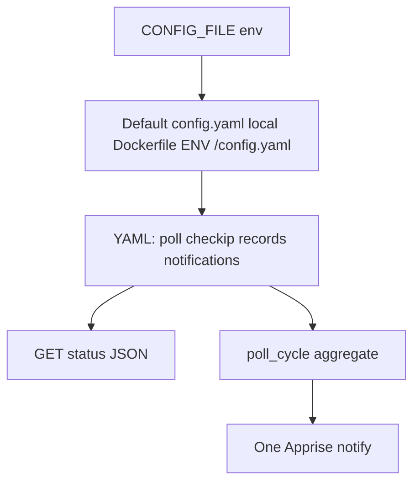

# Phase 3 — Status API, YAML config, Apprise notifications

Authoritative product text: [.plan.md](.plan.md) §Phase 3 (sections **3.1**, **3.2**, **3.3**).

## Current baseline

- [`src/route53_ddns/config.py`](src/route53_ddns/config.py): **`Settings`** uses **`ROUTE53_RECORDS_FILE`** + JSON array; **`POLL_INTERVAL_SECONDS`** / **`CHECKIP_URL`** from env.
- [`AppState`](src/route53_ddns/state.py) / [`poll_cycle`](src/route53_ddns/poller.py) as today.

---

## 3.1 API endpoint

**Requirements (from `.plan.md`)**

- Endpoint returns **JSON** describing current system status.
- Includes **last time any host was updated** and a **list of records**, each with **hostname** and **time last updated**.

**Contract** (from `.plan.md`; remove trailing commas when implementing real JSON):

```json
{
  "lastUpdated": "<ISO Datetime>",
  "records": [
    {
      "host": "<hostname>",
      "lastUpdated": "<ISO Datetime>"
    }
  ]
}
```

**Semantics**

- **`records[].host`**: map from each row’s configured name (e.g. `record_name`), exposed as a **hostname** string (strip trailing `.` for a stable API surface; document in README).
- **`records[].lastUpdated`** / top-level **`lastUpdated`**: ISO-8601 datetimes. When no successful DNS update has occurred yet for a row (or globally), use JSON **`null`** so clients can distinguish “never” from a real instant (not spelled out in the one-line contract but required for correctness).
- **Top-level `lastUpdated`**: max of per-record last update times, or **`null`** if none.

**Implementation**

- Add **`GET`** (path e.g. `/api/status` — choose one, document in README).
- Build payload under `state.lock`; keep formatting logic testable (helper on `AppState` or `state.py`).
- Tests: shape, ISO strings, null cases.

---

## 3.2 YAML config

**Requirements (from `.plan.md`)**

- Move **existing configuration options** into a **YAML** file (replaces scattered env for those options).
- **Route53 records** live in YAML (no separate JSON records file).
- **`HOST` and `PORT` remain environment variables** (not in YAML).
- **Config path**: environment variable **`CONFIG_FILE`** (name is fixed by spec).
- **Default location for local development**: **`config.yaml`** at the **repository base** — implement as default value **`config.yaml`** (relative path; document **run from repo root** or resolve relative to a stable anchor if you already have one).
- **Docker image**: **`CONFIG_FILE` should default to `/config.yaml`** — implement via **`ENV CONFIG_FILE=/config.yaml`** in the [**Dockerfile**](Dockerfile) (and mount `/config.yaml` in Compose), not by hard-coding only a container path in Python (so local default stays `config.yaml`).

**YAML content** (illustrative)

- `poll_interval_seconds`, `checkip_url`, `records:` (list of [`Route53RecordConfig`](src/route53_ddns/config.py) fields), plus **`notifications`** for §3.3.

**Implementation**

- Add **`pyyaml`**; Pydantic models for file content + `CONFIG_FILE` on env-only settings.
- **`get_settings()`** / cache: tests set **`CONFIG_FILE`** to a temp YAML path via [`tests/conftest.py`](tests/conftest.py).
- Remove **`ROUTE53_RECORDS_FILE`** and JSON loading; document migration JSON → YAML `records:` list.

**Docs / examples**

- [`.env.example`](.env.example), [`docker-compose.example.yml`](docker-compose.example.yml), [`README.md`](README.md): **`CONFIG_FILE`**, volume mount, local vs Docker defaults.

---

## 3.3 Notifications

**Requirements (from `.plan.md`)**

- Use **[Apprise](https://github.com/caronc/apprise)**.
- Notification targets **configured in YAML**.
- **One notification** (title + body) when the **background job** either **updates a DNS record** or an **error occurred**.
- **Single run** of the background job → **at most one** notification, even if **multiple** errors or **multiple** record updates occurred in that run.

**Implementation**

- Dependency: **`apprise`** in [`pyproject.toml`](pyproject.toml).
- After **`poll_cycle`**, aggregate outcomes (updated hostnames + error messages), call Apprise **once** in **`asyncio.to_thread`** if `(updates or errors)` and URLs configured.
- Scope: **poller** only unless you explicitly extend later (manual POST not in `.plan.md`).

**Tests**

- Mock / patch; assert call counts for quiet success vs single notify on multi-update / multi-error.

---

## Implementation order

1. **3.2 YAML + `CONFIG_FILE`** — unblocks central config for Apprise URLs and simplifies test fixtures.
2. **3.1 API** — independent of notifications; can follow YAML once state is unchanged.
3. **3.3 Apprise** — depends on YAML and `poll_cycle` summary.



---

## Files (expected)

| Area | Files |
|------|--------|
| API | [`main.py`](src/route53_ddns/main.py), [`state.py`](src/route53_ddns/state.py) |
| Config | [`config.py`](src/route53_ddns/config.py), [`pyproject.toml`](pyproject.toml), [**Dockerfile**](Dockerfile) |
| Notify | [`poller.py`](src/route53_ddns/poller.py), optional `notifications.py` |
| Tests / docs | [`tests/conftest.py`](tests/conftest.py), tests, [`.env.example`](.env.example), [`docker-compose.example.yml`](docker-compose.example.yml), [`README.md`](README.md) |
