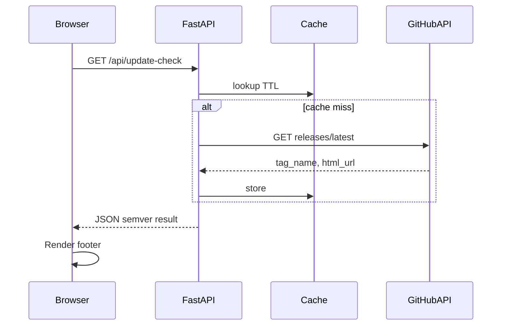

# Phase 4 implementation plan

## Context

Phase 4 in [.plan.md](.plan.md) has two parts: **GHCR publish on Release** and **in-app update awareness** in the footer. The codebase today has:

- Version duplicated in [`pyproject.toml`](pyproject.toml) (`version = "0.1.0"`) and [`src/route53_ddns/__init__.py`](src/route53_ddns/__init__.py) (`__version__`).
- [`Dockerfile`](Dockerfile) with no build-arg for version; [`src/route53_ddns/main.py`](src/route53_ddns/main.py) renders [`src/route53_ddns/templates/index.html`](src/route53_ddns/templates/index.html) with no version/footer.
- **No** `.github/workflows` yet.

## 4.1 — Publish image to GHCR

### Workflow behavior

- Add **one workflow** (e.g. [`.github/workflows/release-ghcr.yml`](.github/workflows/release-ghcr.yml)) with trigger:

  ```yaml
  on:
    release:
      types: [published]
  ```

- `permissions`: at minimum `contents: read` and `packages: write` so `GITHUB_TOKEN` can push to `ghcr.io`.
- Steps: checkout → **normalize the release tag** (see below) → `docker/login-action` for `ghcr.io` → `docker/build-push-action` (or `docker build` + `docker push`) with:
  - **Image name**: `ghcr.io/${{ github.repository_owner }}/${{ github.event.repository.name }}` (or lowercase `github.repository` normalized for GHCR; GHCR requires lowercase repo names).
  - **Tags**: map the **raw** GitHub release tag for the container image label (e.g. `type=raw,value=${{ github.event.release.tag_name }}`), and optionally `latest` only when appropriate (e.g. not a prerelease — use `github.event.release.prerelease` if you want that rule).

### Tag normalization (workflow-only)

- **All semver-oriented normalization happens in the workflow**, not in the Dockerfile. Example: compute a step output or env var from `github.event.release.tag_name` by stripping a leading `v` (e.g. `v1.2.3` → `1.2.3`) so `APP_VERSION` inside the container matches what semver comparison and the UI expect.
- Use that **normalized string** only for `--build-arg APP_VERSION=...` (and any docs that describe “app version in published images”). **Do not** duplicate strip logic in the Dockerfile for the version baked into the app.

### Bake release tag into the image

- Extend [`Dockerfile`](Dockerfile) with:

  - `ARG APP_VERSION=dev` (or similar default for local builds).
  - `ENV APP_VERSION=$APP_VERSION` (or equivalent) so the running process sees the version without reading the filesystem layer.

- Pass from the workflow: `--build-arg APP_VERSION=<normalized_tag>` (the value produced by the workflow step above, not the raw `tag_name` unless it is already normalized).

### Single source of truth at runtime

- In [`src/route53_ddns/__init__.py`](src/route53_ddns/__init__.py), set `__version__` from:

  1. `os.environ.get("APP_VERSION")` if set and non-empty (Docker / CI),
  2. else `importlib.metadata.version("route53-ddns")` for local editable installs.

- Keep `pyproject.toml` as the **development** default; document that **published images** report the release tag via `APP_VERSION` (no need to rewrite `pyproject.toml` inside the image if runtime env is authoritative).

### Documentation

- Update [`README.md`](README.md) with a short **“Container image”** section: images are published to GHCR on **Release publish**; the **image tag** follows the GitHub release tag, while **`APP_VERSION` inside the image** is the **workflow-normalized** form (e.g. leading `v` stripped for semver consistency).

---

## 4.2 — Update check in the web UI

### Configuration

- **Repo identity** for the GitHub API must be explicit (this repo does not hardcode an org in README). Add optional env vars (names can be aligned with GitHub conventions):

  - `GITHUB_REPOSITORY` — `owner/repo` (same as Actions’ variable). **When unset**, skip the “latest release” call and only show the current app version in the footer.
  - Optional: `GITHUB_API_BASE` default `https://api.github.com` for tests/mocks.

- Extend [`src/route53_ddns/config.py`](src/route53_ddns/config.py) `Settings` with these fields; document in [`.env.example`](.env.example).

### Backend: fetch latest release + semver compare

- Implement a small helper (e.g. `src/route53_ddns/github_release.py` or inside `main.py` if tiny) that:

  - `GET https://api.github.com/repos/{owner}/{repo}/releases/latest` via **`httpx.AsyncClient`** (reuse the app’s shared client from lifespan, or a dedicated short-lived client — follow existing patterns in [`src/route53_ddns/main.py`](src/route53_ddns/main.py)).
  - Parse JSON `tag_name` and `html_url` (link to the specific release).
  - Compare **latest tag** vs **current** `__version__` using **semver** after stripping optional leading `v` on both sides. Use `packaging.version.Version` (add `packaging` to [`pyproject.toml`](pyproject.toml) dependencies if not already pulled transitively) or a small dedicated `semver` dependency—prefer **`packaging`** to stay lightweight and consistent with Python tooling.

- **Caching**: cache the GitHub response in memory for **~5–15 minutes** (simple `time.monotonic()` + dict on `AppState` or module-level with lock) to avoid rate limits when many users reload the UI.

- Expose **`GET /api/update-check`** (or similar name) returning JSON, e.g.:

  ```json
  {
    "app_version": "1.2.3",
    "github_repository_configured": true,
    "latest_version": "1.2.4",
    "release_url": "https://github.com/.../releases/tag/...",
    "update_available": true
  }
  ```

  When `GITHUB_REPOSITORY` is unset, return `update_available: false` and `github_repository_configured: false` (and omit or null out latest fields).

- **Errors** (network, 404, API errors): return a safe payload with `update_available: false` and optional `error` string for UI/debug; log at WARNING/ERROR per existing logging style.

### Frontend: footer + client behavior

- Update [`src/route53_ddns/templates/index.html`](src/route53_ddns/templates/index.html):

  - Add a `<footer>` **below** the main table (per phase text) with a placeholder for version text and an update banner.
  - Include a small script (new file under [`src/route53_ddns/static/`](src/route53_ddns/static/) or extend existing JS) that on `DOMContentLoaded` calls `GET /api/update-check` and:
    - Always shows **current version** (from JSON).
    - If `update_available`, shows a short message with **new version** and a **link** to `release_url` (opens in new tab).

### Tests

- Add unit tests with **mocked httpx** (project already uses `respx` in dev) for: newer release → `update_available: true`; same/older → `false`; missing env → no GitHub call.

---

## Diagram (data flow for update check)



---

## Files to touch (expected)

| Area | Files |
|------|--------|
| CI | New [`.github/workflows/release-ghcr.yml`](.github/workflows/release-ghcr.yml) |
| Docker | [`Dockerfile`](Dockerfile) — `ARG`/`ENV` for `APP_VERSION` |
| Version | [`src/route53_ddns/__init__.py`](src/route53_ddns/__init__.py) |
| Config | [`src/route53_ddns/config.py`](src/route53_ddns/config.py), [`.env.example`](.env.example) |
| API + logic | [`src/route53_ddns/main.py`](src/route53_ddns/main.py) + new helper module (optional) |
| UI | [`src/route53_ddns/templates/index.html`](src/route53_ddns/templates/index.html), [`src/route53_ddns/static/`](src/route53_ddns/static/) |
| Deps | [`pyproject.toml`](pyproject.toml) if `packaging` explicitly needed |
| Docs | [`README.md`](README.md) |

---

## Optional follow-ups (out of scope unless you want them)

- **Private repos**: authenticated GitHub API (`GITHUB_TOKEN` passed as secret into the container) — not required for public releases.
- **`.plan.md`**: sync repo copy if you change the master plan (per repo rule in `.plan.md`).
