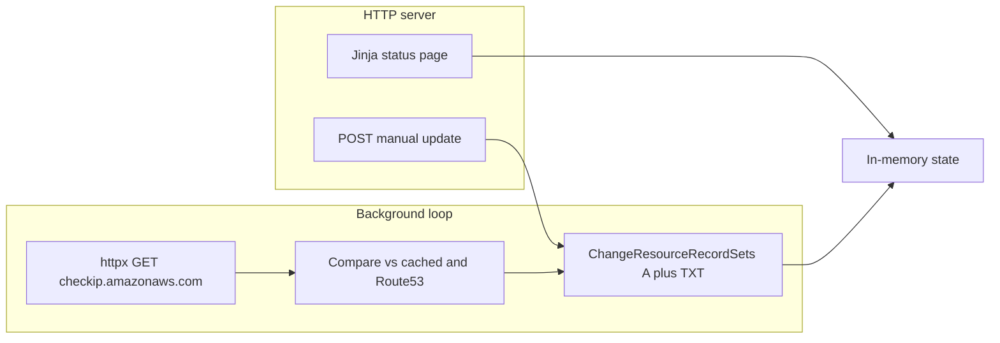

# Route53 dynamic DNS — implementation plan

## Context

[DESIGN.md](DESIGN.md) requires: Docker build; public IPv4 from `https://checkip.amazonaws.com`; configurable Route53 **zone id + record name**; background job to detect IP changes and update records; a basic website with the listed fields and a manual update button enabled only when current public IP differs from the AWS-record IP; **AWS credentials loadable from a credentials file supplied as a Docker secret** (documented in README); **informational status and errors logged to standard output**; **when updating a DNS record, an appropriately named TXT record stored alongside the A record containing the update time**; Python 3 with a venv for local dependencies.

**Repository artifact:** maintain **`.plan.md`** at the project root as a copy of this implementation plan (see todo `project-plan-md`) so the repo is self-contained outside Cursor’s plan store.

Implementation is **from scratch**. Prior choices still apply: **no web auth** (rely on network placement / document risks) and **multiple Route53 records** per deployment (extends “zone id + record name” to a list).

## Architecture



- **Single process** (simplest for Docker): FastAPI + Uvicorn, with a **background task** (async loop or `asyncio.create_task`) that runs the poll on an interval.
- **Outbound HTTP for public IP**: use **`httpx.AsyncClient`** (async) for `GET https://checkip.amazonaws.com`—no blocking `urllib`/`requests` in the async poll path; reuse one client instance (e.g. app lifespan) with sane timeouts.
- **Shared in-memory state** (thread-safe updates via a lock or `asyncio.Lock`): current public IP, per-record Route53-resolved IP, last poll time, next poll time, per-record last successful DNS update time, last error string (optional but useful for ops).

## Configuration

| Concern          | Approach |
| ---------------- | -------- |
| Multiple records | JSON in env (e.g. `ROUTE53_RECORDS`) **or** a mounted file path env; each entry: `hosted_zone_id`, `record_name` (FQDN with trailing dot recommended), optional `ttl` (default e.g. 300), optional `txt_record_name` (FQDN for companion TXT; see next row). |
| Companion TXT    | Per DESIGN: whenever the **A** record is updated, **UPSERT** a TXT record **alongside** it whose **value is the update time** (ISO-8601 UTC). Default an **appropriately named** companion FQDN (e.g. `_ddns-last-update.<same-labels-as-A>` in the same zone) so unrelated TXT at the A hostname is not overwritten; allow override via `txt_record_name`. Document in README. |
| Poll interval    | Env `POLL_INTERVAL_SECONDS` — **default 4 hours** (`14400` seconds). |
| AWS credentials  | Support the **shared credentials file** path used by boto3: set `AWS_SHARED_CREDENTIALS_FILE` to a file path (e.g. secret mounted at `/run/secrets/aws_credentials` in Compose/Swarm). Document in README: create secret file in INI format (`[default]` / `aws_access_key_id` / `aws_secret_access_key`), mount read-only, set env in container. Also document fallback: env vars (`AWS_ACCESS_KEY_ID` / `AWS_SECRET_ACCESS_KEY`), instance/task IAM role—**Docker secret file is the DESIGN-mandated path to document explicitly**. |
| Logging          | Python `logging` (or structlog) configured to **stdout**: INFO for normal status (poll start/end, IP seen, skip/update decisions), ERROR/WARNING for failures (HTTP, Route53, config). No duplicate noisy logs per request unless useful. |
| Outbound HTTP    | **`httpx`** as the **async** client for all outbound HTTP from the app (at minimum the checkip request). Use `httpx.AsyncClient`, configure timeouts; inject or hold a shared client for the poller. Do not use sync `requests`/`urllib` in the async poll loop. |
| Bind address     | Env `HOST` / `PORT` (e.g. `0.0.0.0:8080` for Docker; document that **without auth**, only expose on trusted networks or behind a reverse proxy). |

## Core behaviors

1. **Public IP**: `GET https://checkip.amazonaws.com` via **`httpx.AsyncClient`** (async) → read response text, strip whitespace; validate IPv4.
2. **Per record**, read current Route53 A value: `list_resource_record_sets` filtered by name/type, or upsert path that assumes one A record per name (handle “no record” as “needs create”).
3. **When public IP changes** or differs from Route53: one `ChangeResourceRecordSets` batch (or atomic multi-change) with **`UPSERT` for `A`** (IPv4) **and `UPSERT` for companion `TXT`** set to the **current update time** (ISO-8601 UTC). If Route53 API rejects batching, use two changes in one request (supported: multiple `Change` elements in one `ChangeBatch`).
4. **Manual update** (POST): same upsert logic (A + TXT); **enable button in UI only when** `current_public_ip != route53_ip` for that row (**per-row** matches multi-record best).
5. **Timestamps**: UTC ISO strings in UI; store `last_check_at`, `next_check_at` (computed as `last_check_at + interval`), `last_dns_update_at` per record (aligned with TXT value when update succeeds).

## Web UI (minimal but complete)

- **Current public IP** — single value (same for all rows unless future multi-WAN; not in DESIGN).
- **Currently set IP per DNS record** — one column per configured record (Route53 A value).
- **Last check run + next run** — visible (e.g. header/footer).
- **Last time DNS records were updated** — list per record (timestamps), matching “Lists the last time…”.
- **Manual update button** — per out-of-sync row; **enabled only when** current public IP **differs** from the IP in AWS for that record.

Implementation: one page, table with columns — record name, current public IP, IP in Route53, last DNS update, **Update** button (disabled when in sync). Plain HTML + small CSS (no SPA required).

## Docker / local dev

- **Python**: Latest stable Python 3 image in Dockerfile (e.g. `python:3.13-slim`); pin in README.
- **Local venv**: `python -m venv .venv`, `pip install -r requirements.txt` or `pip install -e .` if using `pyproject.toml`.
- **Dockerfile**: copy app, `pip install`, `CMD`/`ENTRYPOINT` to run Uvicorn; `EXPOSE` the configured port; **no secrets in image**.
- **Docker secret for credentials**: README must show mounting a file (e.g. Compose `secrets:` → `/run/secrets/...`) and setting `AWS_SHARED_CREDENTIALS_FILE` (or document symlink/copy to `~/.aws/credentials` if using default profile—prefer explicit env for clarity). Validate at startup that credentials are usable or log a clear ERROR.
- **`.env.example`**: all env vars with comments; **no** committed `.env`.

## Files to add (suggested layout)

- `pyproject.toml` or `requirements.txt` — `fastapi`, `uvicorn[standard]`, `jinja2`, `boto3`, **`httpx`** (required: **async** HTTP client for checkip and any future outbound calls).
- `src/` or package root: `main.py` (app factory, routes), `config.py`, `route53.py` (A + TXT upsert helpers), `poller.py`, `state.py`, `templates/index.html`.
- `Dockerfile`, optional `.dockerignore`.
- **`.plan.md`** at **project root** — full implementation plan for developers/CI; keep in sync when this Cursor plan changes (initial creation: copy body from this file after removing YAML frontmatter).
- `README.md` — how to run locally, required IAM policy (Route53 change + list on scoped zones), **Docker secret + credentials file** walkthrough, **companion TXT naming and purpose**, security note for unauthenticated UI.

## IAM (document, not code)

Minimal policy idea: `route53:ChangeResourceRecordSets`, `route53:ListResourceRecordSets` on the specific hosted zone ARNs (or `*` for homelab with warning).

## Testing strategy (lightweight)

- Unit tests with **mocked** boto3 and **httpx** (e.g. `httpx.MockTransport`, `respx`, or patching `AsyncClient.get`) for IP fetch; assert **A + TXT** changes appear together (or expected change batch) on update.
- Optional: one integration test skipped by default (real AWS).

## Risks called out in docs

- **No auth**: anyone who can reach the port can trigger updates and read IPs—acceptable only on trusted networks; recommend Docker user networks or firewall rules.

# Phase 2

## 2.1 Web UI Updates
* Display dates in a human readable form, e.g. 10:35 AM, Wed Apr 19, 2026
* Display absolute times in the viewer’s local timezone (browser).
* Additionally, display a relative time from now for dates (minutes/hours/days before/from now)

## 2.2 Update All Function
* Add a new button in the UI to update all configured records at once.
* This button should only be enabled if at least one record is out of date.
* This function should only update the out of date records.

# Phase 3

## 3.1 API Endpoint

* Implement an endpoint that returns a JSON document indicating the current status of the system.
* The api should return the last time any host was updated and a list of each record, with the hostname and the time it was last updated.
* This should use the following contract:
```json
{
  "lastUpdated": "<ISO Datetime>",
  "records": [
    {
      "host": "<hostname>",
      "lastUpdated": "<ISO Datetime>",
    }
  ]
}
```

## 3.2 YAML Config

* Convert existing configuration options to a yaml config file
* Route53 records should, instead of a json file, be configured in the yaml file as well.
* HOST and PORT configurations should remain as environment variables.
* The location of the config file should be set with an environment variable: CONFIG_FILE
* Internally, the default config location should simply be "config.yaml" (at the base of the repo), for local development.
* In the docker image, this environment variable should default to "/config.yaml"

## 3.3 Notifications

* Use the Apprise library: https://github.com/caronc/apprise to provide notifications
* Notification services to use should be configured via the yaml config.
* A notification should be sent with an appropriate title and body when the background job either updates a DNS recordor an error occured.
* For a single run of the background job, only a single notification should be sent, even if multiple errors occured or multiple records were updated.

# Phase 4

## 4.1 Publish Image to GHCR

* Create a github workflow that will build the docker image and push it to ghcr
* The workflow should be triggered when a Release is created in github.
* When building in the workflow, the version in the app should be populated from the release tag.

## 4.2 Implement update check in the Web UI

* The UI should display the current application version.
* When loaded, we should also retrieve the latest release from github and compare it to the current version (using semver).
* If the release in github is newer than the current application. we should display a message to the user in the web ui that an update is available.
* If an update is available, the message should show the new version with a link to the specific release in github.
* This should be populated in a footer below the main content of the page.
